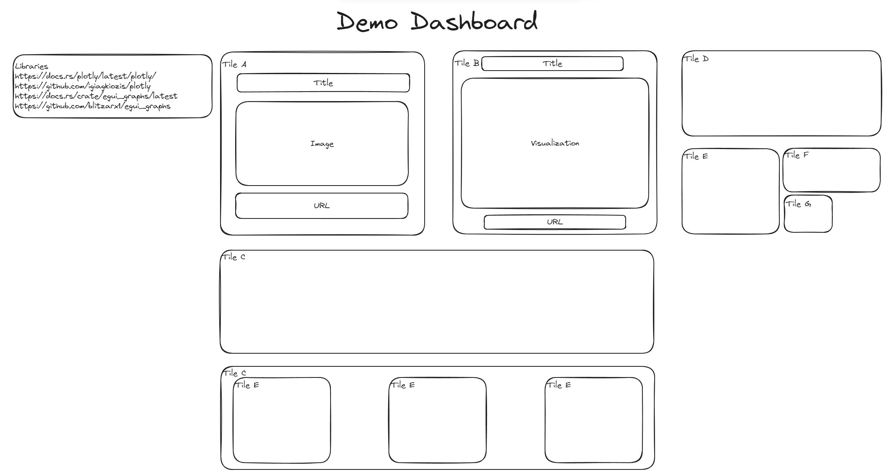

# demo-dashboard documentation

## Design Architecture



## Dependencies

Install the following dependencies:

- [Rust](https://www.rust-lang.org/tools/install) to run the application on the server 
- Install the Dioxus tooling
- Install the dioxus-cli
  
https://github.com/DioxusLabs/dioxus/tree/master/packages/cli

```bash
cargo install dioxus-cli@0.5.0-alpha.2
```

- Install the `wasm32-unknown-unknown` target for Rust

```bash
rustup target add wasm32-unknown-unknown
```

- Create the demo-dashboard crate

*Note: you may have to search to find the directory you want to `cd` into.*
```bash
cargo new --bin demo-dashboard
cd demo-dashboard
```

- Run this command to add the web renderer dependencies to the `Cargo.toml` file

```bash
cargo add dioxus@0.5.0-alpha.2 --features fullstack
```


Using the Dioxus Config file and the Dioxus CLI you can create a `Dioxus.toml` file in the root of your project. This file will contain the configuration for the Dioxus CLI.

```toml
[application]
name = "project-name"
# Currently supported platforms: web, desktop
default_platform = "web"

[web.app]
title = "Hello"

[web.watcher]

[web.resource.dev]
```

## Running the application

- Run the application on the server

```bash
dx serve --platform fullstack
```

## Running the application using a Docker container

- Build the Docker image

```bash
docker build -t demo-dashboard .
```

- Run and test the Docker image

```bash
docker run -p 8080:8080 demo-dashboard
```

- Uploading the Docker image to the Docker Hub

```bash
docker tag uhstray/demo-dashboard:latest uhstray/demo-dashboard:latest
docker push uhstray/demo-dashboard:latest
```

- Pulling the Docker image from the Docker Hub

```bash
docker pull uhstray/demo-dashboard:latest
```

## Useful Commands

```bash
dx fmt
```


## Reference

- Example Projects : https://github.com/DioxusLabs/example-projects/tree/master
- Rust : https://www.rust-lang.org/
- Dioxus : https://dioxuslabs.com/
- Dioxus CLI : https://github.com/DioxusLabs/dioxus/tree/master/packages/cli